# 🛡️ Sentinel

### Personal Cybersecurity Dashboard

Sentinel is a lightweight cybersecurity dashboard built with Python and Flask that provides practical security analysis tools through a single web interface.

It is designed as an educational and portfolio project to demonstrate concepts in cybersecurity, web development, file integrity, password security, URL analysis, and security logging.

---

## ✨ Features

- 🔐 **Password Security Analyzer**
  - Password strength analysis
  - Character and length checks
  - Common password detection
  - Pattern detection
  - Entropy estimation
  - Educational crack-time estimation
  - Live strength feedback

- #️⃣ **File Hash Checker**
  - SHA-256 calculation
  - SHA-512 calculation
  - MD5 calculation for legacy/integrity purposes
  - SHA-256 integrity verification
  - MATCH / MISMATCH detection
  - Chunk-based file processing

- 🔗 **URL Security Analyzer**
  - HTTPS detection
  - IP address detection
  - Private/local IP detection
  - Punycode detection
  - Suspicious port detection
  - URL-shortener detection
  - Embedded credential detection
  - URL structure analysis

- 📋 **Security Logs**
  - Records security-tool activity
  - Timestamped events
  - Recent activity dashboard
  - Security event statistics

- 📊 **Cybersecurity Dashboard**
  - Total scans
  - URL scans
  - File scans
  - Security events
  - Recent activity overview

  ---

## 🧰 Technologies Used

| Technology | Purpose |
|---|---|
| Python | Core application logic |
| Flask | Web application framework |
| HTML5 | Webpage structure |
| CSS3 | UI and visual design |
| JavaScript | Live password analysis and interactions |
| JSON | Local security-log storage |
| Git & GitHub | Version control and project hosting |

---

## 🏗️ Project Architecture

```text
Sentinel/
│
├── app.py
├── requirements.txt
├── README.md
├── .gitignore
│
├── static/
│   ├── script.js
│   └── style.css
│
├── templates/
│   ├── index.html
│   ├── password_checker.html
│   ├── hash_checker.html
│   ├── url_security.html
│   └── security_logs.html
│
└── utils/
    ├── __init__.py
    ├── password_checker.py
    ├── hash_checker.py
    ├── url_checker.py
    └── log_manager.py

```

---

## 📸 Screenshots

### 📊 Dashboard

The Sentinel dashboard provides an overview of security scans, recent activity, security events, and available security tools.

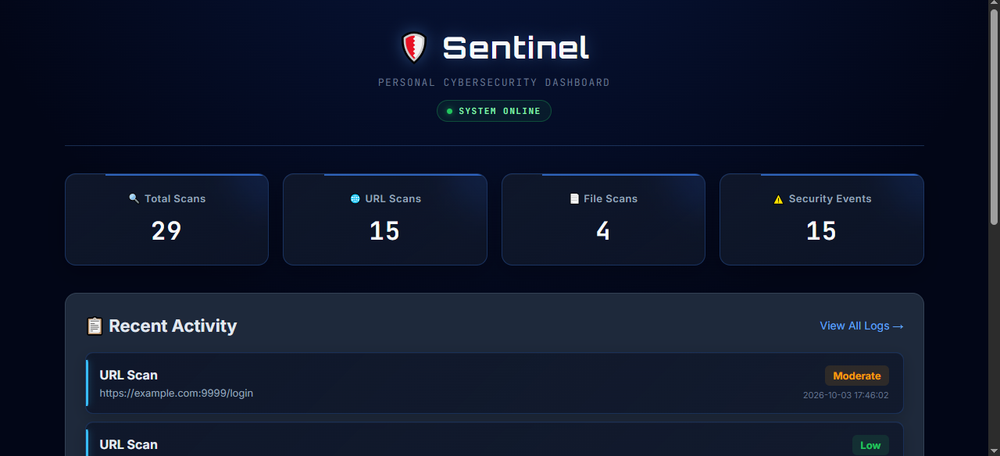

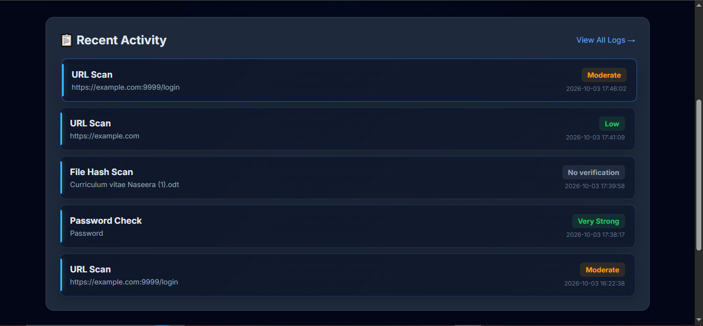

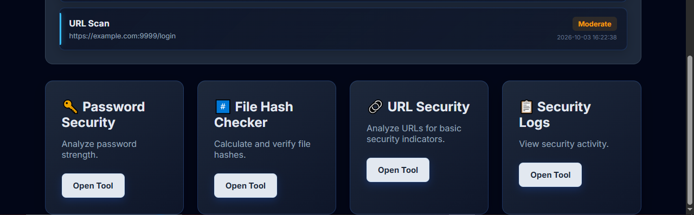

---

### 🔐 Password Security

The password analyzer provides live strength feedback, entropy estimation, theoretical brute-force estimates, and improvement suggestions.

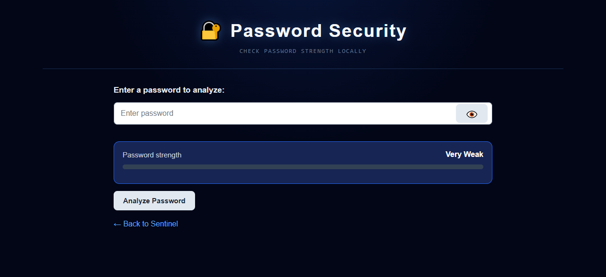


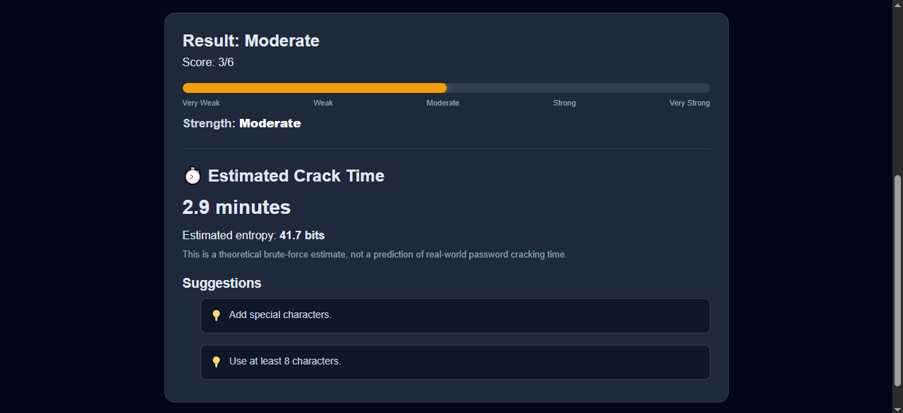

---

### #️⃣ File Hash Checker

The file hash checker calculates SHA-256, SHA-512, and MD5 hashes and supports SHA-256 integrity verification.

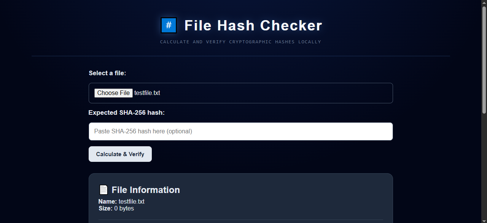

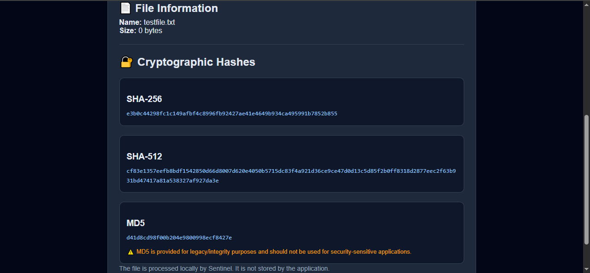

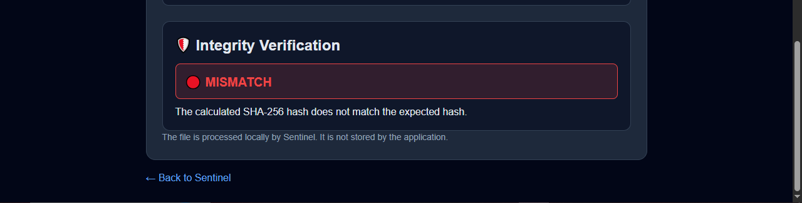

---

### 🔗 URL Security

The URL security analyzer examines URL structure for configured security indicators and provides explanations for detected findings.

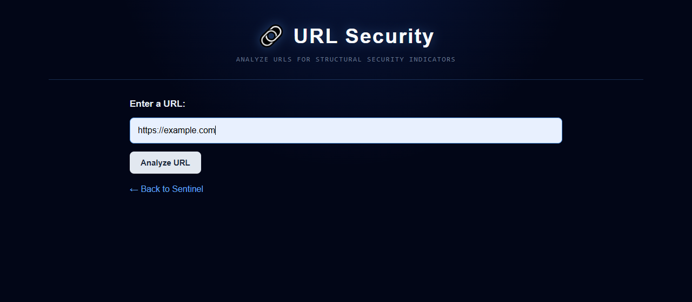

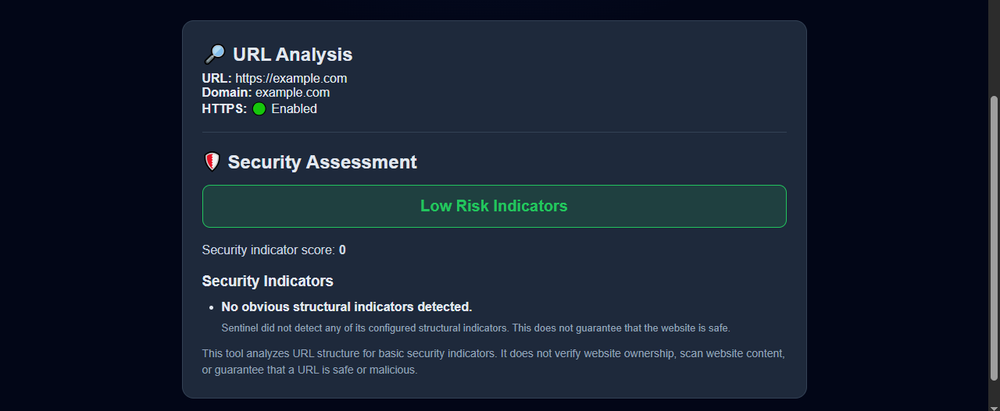

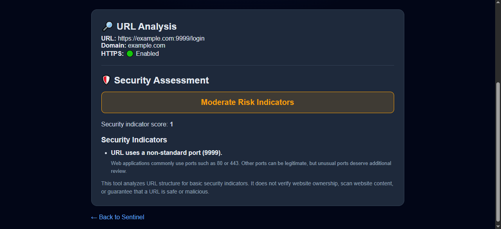

---

### Password Security

Live password-strength analysis with entropy, theoretical brute-force estimates, common-password detection, and security recommendations.

### File Hash Checker

Calculates SHA-256, SHA-512, and MD5 hashes and provides SHA-256 integrity verification.

### URL Security

Analyzes URL structure for security indicators and provides explanations for detected findings.
---
## 🔮 Future Improvements

Potential future enhancements include:

- 🌐 Threat-intelligence API integration
- 🦠 Malware and file reputation analysis
- 🔎 DNS and domain reputation checks
- 📡 Network security monitoring
- 📊 Advanced security analytics
- 📄 Exportable security reports
- 🗄️ Database-backed security logs
- 👤 User authentication and access control
- 🚨 Configurable security alerts

---

## 🎯 Project Goals

Sentinel was built to strengthen practical skills in:

- Python development
- Flask web applications
- Cybersecurity fundamentals
- File integrity verification
- Password security concepts
- URL analysis
- Security logging
- Front-end development
- Git and GitHub
- Secure application design

---

## 👨‍💻 Author

**Syed Zuhair**

IoT, Blockchain & Cybersecurity Engineering Student

Interested in:

- Cybersecurity
- Software Development
- IoT
- Artificial Intelligence
- Ethical Security Research

---

## 📄 License

This project is intended primarily for educational and portfolio purposes.